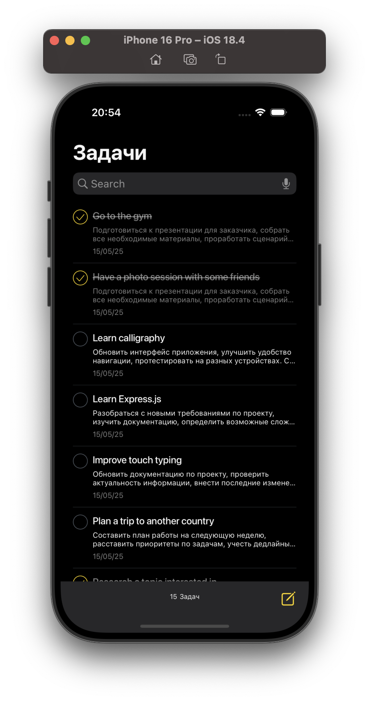
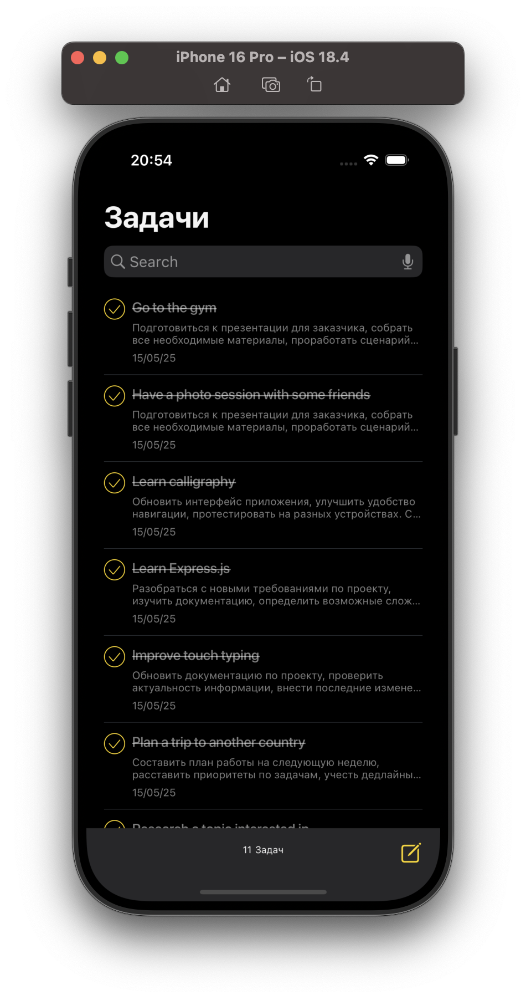
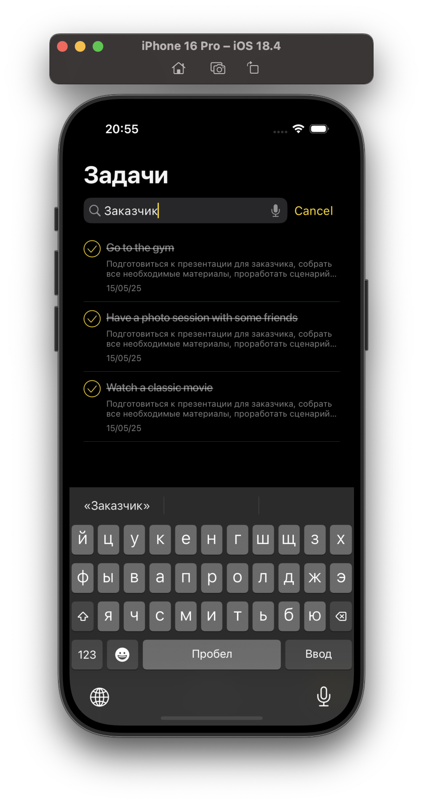
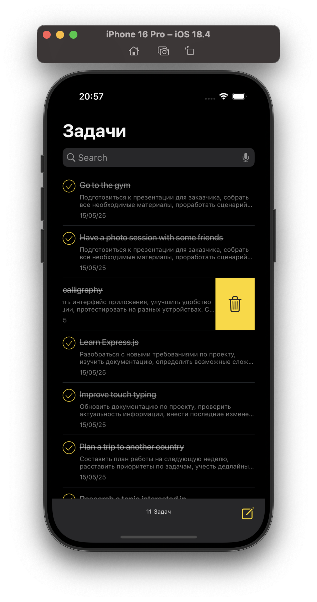
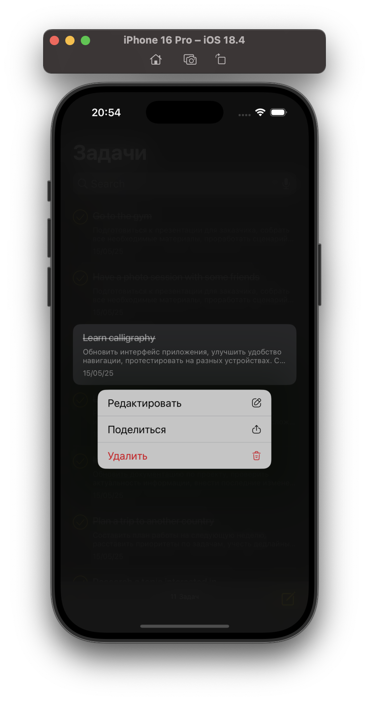
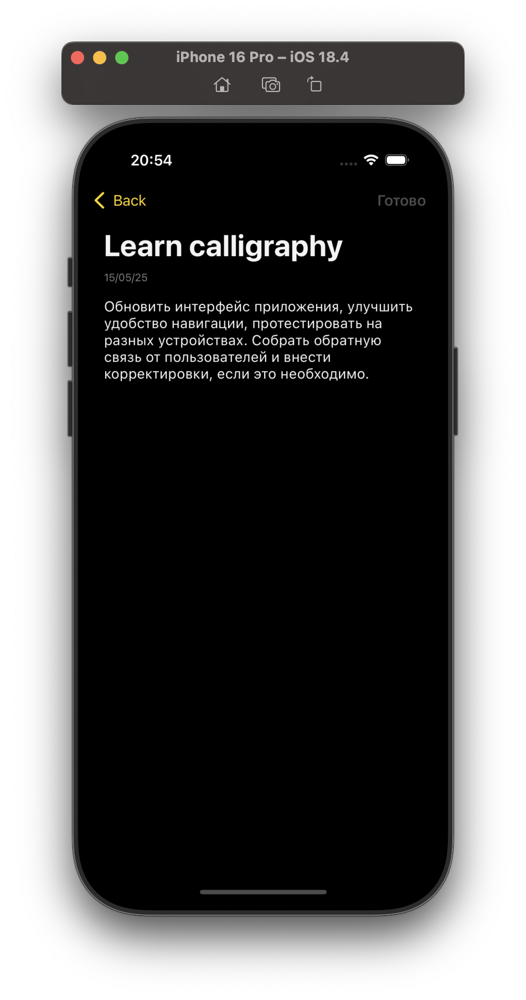
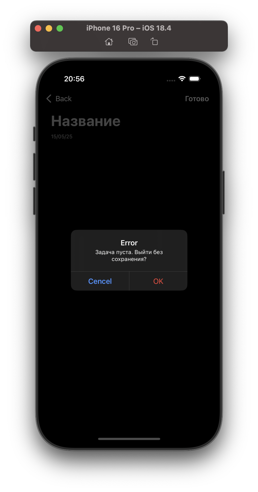

# ToDoList

## Описание проекта

ToDoList — это современное и удобное приложение для ведения списка задач. Основной упор сделан на производительность, удобство использования и качественную архитектуру.

Приложение создано с нуля на базе архитектурного паттерна VIPER, использует UIKit и локальное хранилище данных, а также включает сетевой слой, подгружающий тестовые данные при первом запуске.

### Основные возможности

• ✅ **Создание и управление задачами:** Лёгкое добавление, редактирование и удаление задач.  
• 🎤 **Голосовой поиск:** Кастомный Search Bar с возможностью голосового ввода.  
• 🔍 **Интеллектуальный поиск:** Быстрый и точный поиск по задачам.  
• 🌐 **Сетевой старт:** При первом запуске список задач загружается из внешнего источника для демонстрации функциональности.  
• 🌙 **Производительность:** Все ресурсоёмкие операции выполняются в фоне, не блокируя UI.  
• ✨ **Анимации:** Плавные нативные анимации делают взаимодействие с приложением приятным.  
• 🎨 **Современный дизайн:** Визуально чистый и удобный интерфейс, адаптированный под iOS-гайдлайны.

### Технологии

• **Swift** — основной язык разработки.  
• **UIKit** — для построения интерфейса.  
• **VIPER** — модульная архитектура с чётким разделением ответственности.  
• **Core Data** — надёжное локальное хранилище данных.  
• **URLSession / Custom Networking Layer** — загрузка задач из внешнего источника.  
• **XCTest** — модульные тесты покрывают все основные компоненты.

### Особенности реализации

• 🗃 **Локальное хранилище:** Все данные хранятся локально с использованием Core Data.  
• 🧪 **Покрытие тестами:** Каждый модуль протестирован — легко поддерживать и масштабировать.  
• 🔄 **Асинхронные операции:** Все тяжёлые задачи (загрузка, сохранение, поиск) вынесены в фоновый поток.  
• 🧭 **Кастомный UI:** Собственный Search Bar с голосовым вводом и UI-улучшениями.  
• 📱 **Поддержка UX-гайдлайнов iOS:** Максимальное внимание к деталям — от цвета до поведения элементов.

### Структура проекта

Проект построен по паттерну VIPER, где каждый экран включает:  
• **View** — отображение данных.  
• **Interactor** — бизнес-логика.  
• **Presenter** — связующее звено между View и Interactor.  
• **Entity** — модель данных.  
• **Router** — навигация между экранами.

## Заключение

**ToDoList** — это не просто список задач. Это демонстрация грамотной архитектуры, удобного интерфейса и качественной инженерной реализации. Надёжный, быстрый и приятный в использовании.

## Скриншоты

   
  
  
